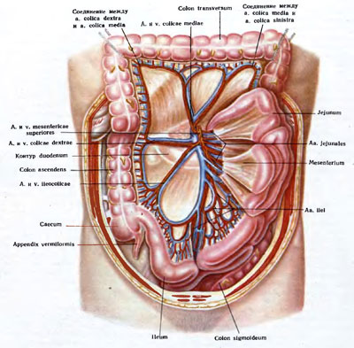
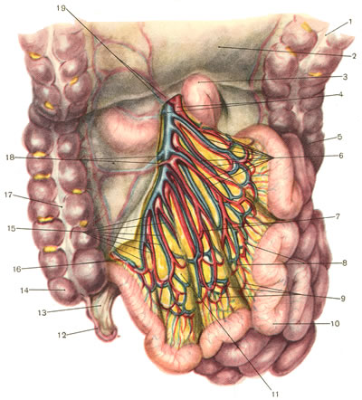
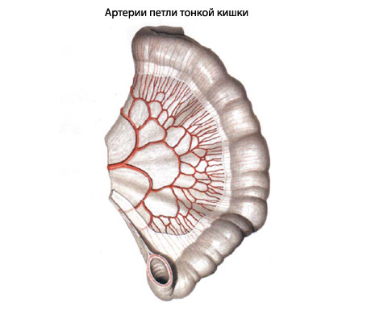
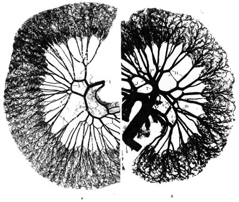
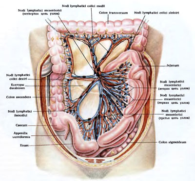
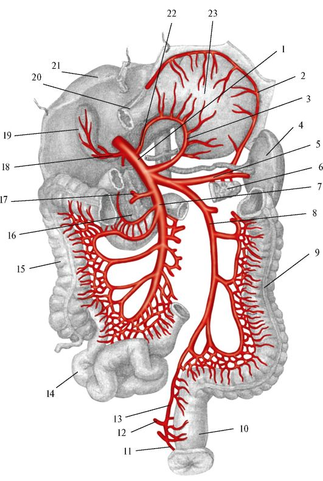
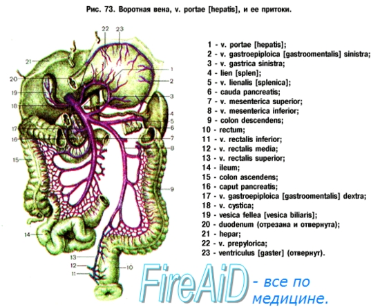
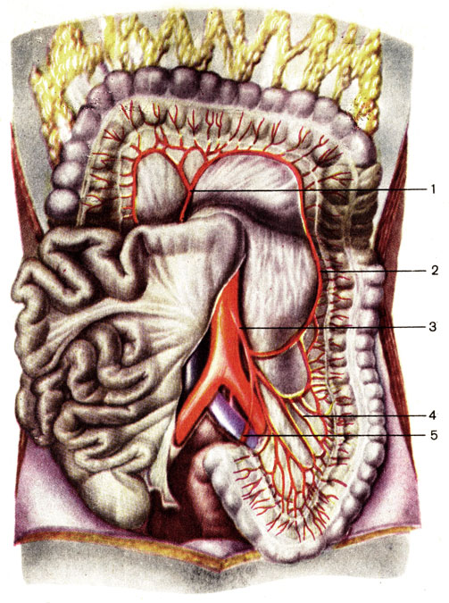
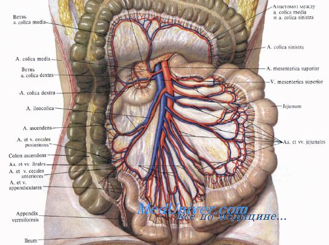
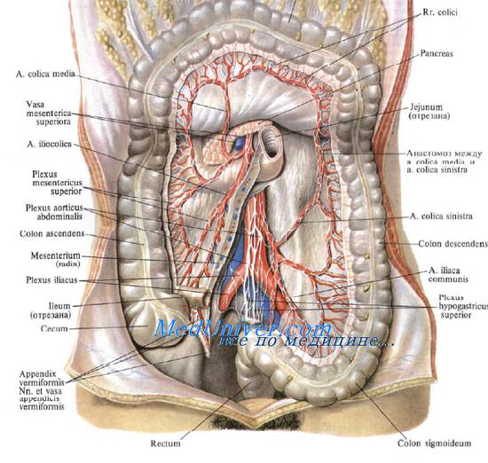

# Кровоснабжение

Артерии, вены и нервы тонкой и толстой кишки Вид спереди.

Поперечная ободочная кишка оттянута кверху
Каждая тощекишечная артерия, направляясь к кишке, делится не две ветви, которые соединяются с такими же ветвями соседних артерий, образуя дуги (аркады) первого порядка. От этих артериальных дуг отходят ветви, которые в свою очередь анастомозируют между собой, образуя аркады второго порядка; таким же образом возникают и аркады третьего порядка. Количество артериальных дуг на протяжении брыжейки кишки индивидуально варьирует. В начальном отделе их меньше, чем в среднем.

Артерии и вены тонкой кишки. Листок висцеральной брюшины брыжейки иссечен.
1 — colon transversum; 2 — mesocolon; 3 — flexura duodenojejunalis; 4 — a. et v. mesenterica superior; 5 — colon descendens; 6 — aa. et vv. jejunales; 7 — артериальные аркады первого порядка; 8 — артериальные аркады второго порядка; 9 — артериальные аркады третьего порядка; 10 — петли тонкой кишки; 11 — mesenterium; 12 — appendix vermiformis; 13 — mesenteriolum appendicis vermiformis; 14 — caecum; 15 — aa. et vv. ilei; 16 — a. ileocolica; 17 — colon ascendens; 18 — a. et v. colica dextra; 19 — a. et v. colica media.

Из венозного подслизистого сплетения берут начало прямые вены, которые сопровождают одноименные артерии, и, сливаясь друг с другом, как и артерии, образуют аркады первого, второго и третьего порядка

Артерии и вены тонкой кишки (рентгенограммы).
а—артерии тонкой кишки; б — вены тонкой кишки; 1— a. jejunalis; 2 — аркада первого порядка; 3 — аркада второго порядка; 4 — аркада третьего порядка; 5 — прямые ветви; в — v. mesenterica superior; 7 — v. jejunalis; 8— аркада первого порядка; 9 — аркада второго порядка; 10 — аркада третьего порядка; 11 — прямые ветви.

Лимфатические сосуды и узлы тонкой и толстой кишки. Вид спереди.

**Воро́тная ве́на**  (лат. vena portae) у человека и животных — венозный ствол, по которому кровь от желудка, селезёнки, кишечника (кроме нижней трети прямой кишки у людей) и поджелудочной железы проходит в печень. Название происходит от «ворот» печени, куда она впадает.

### Другие изображения

