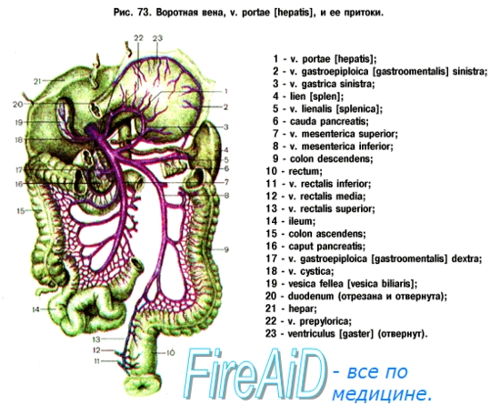

# Толстая кишка

*Толстый кишечник* — более толстая трубка, разделенная на секции. Здесь
в основном происходит всасывание воды из пищи и формирование каловых
масс. Начинается со *слепой кишки* (нижняя часть брюшной полости
справа), в которую впадает подвздошная кишка тонкого кишечника. От
слепой кишки отходит *аппендикс* — червеобразный отросток, который
участвует в работе иммунной и лимфатической систем и является местом
хранения для дружественных организму бактерий.

Слепая кишка переходит в *ободочную кишку*, которая состоит из трех
сегментов: *восходящая* кишка (правая сторона брюшной полости, снизу
вверх), *поперечная* (верхняя часть брюшной полости, справа налево),
*нисходящая* (левая сторона брюшной полости, сверху вниз). Работа с
ободочной кишкой помогает сбалансировать левую и правую стороны тела.

Ободочная кишка переходит в *прямую кишку*, которая заканчивается
анальным отверстием и имеет сфинктеры, которые человек может до
определенного момента удерживать сознательно.

**Воро́тная ве́на**  (лат. vena portae) у человека и животных — венозный ствол, по которому кровь от желудка, селезёнки, кишечника (кроме нижней трети прямой кишки у людей) и поджелудочной железы проходит в печень. Название происходит от «ворот» печени, куда она впадает.

