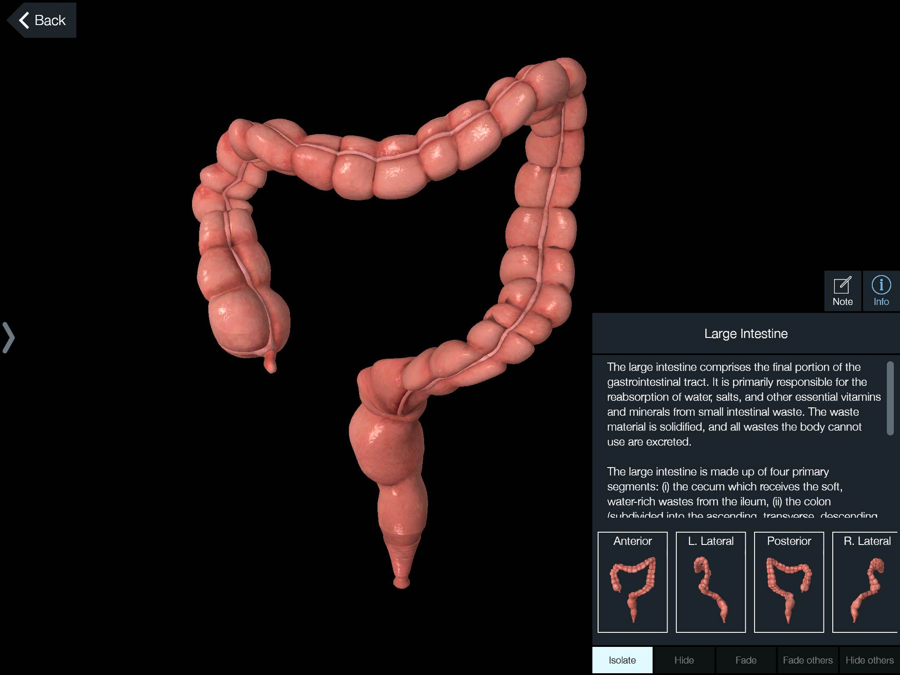

# Толстый кишечник

*Толстый кишечник* — толстая трубка, разделенная на секции.  
Начинается со *слепой кишки* (нижняя часть брюшной полости
справа)
Слепая кишка переходит в *ободочную кишку*, которая состоит из трех
сегментов: *восходящая* кишка (правая сторона брюшной полости, снизу
вверх), *поперечная* (верхняя часть брюшной полости, справа налево),
*нисходящая* (левая сторона брюшной полости, сверху вниз).  
Работа с
ободочной кишкой помогает сбалансировать левую и правую стороны тела.

