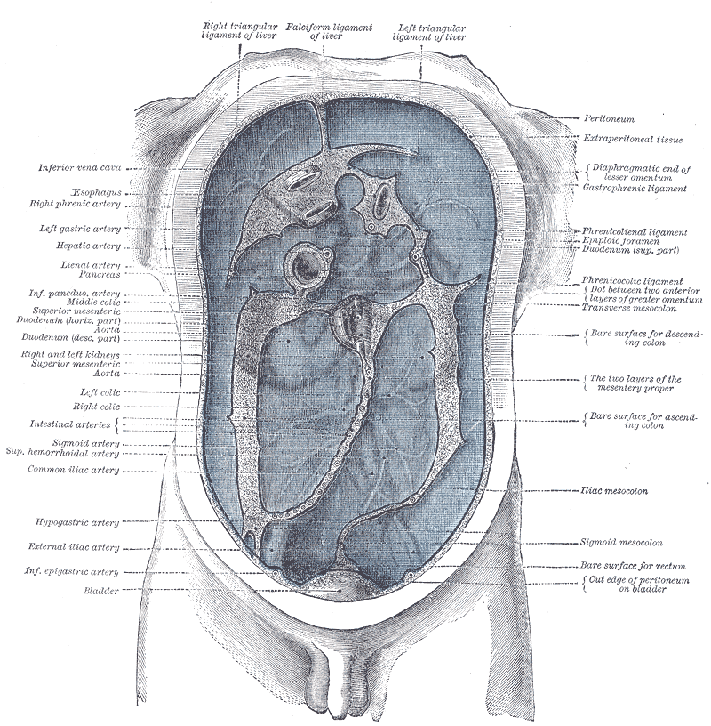
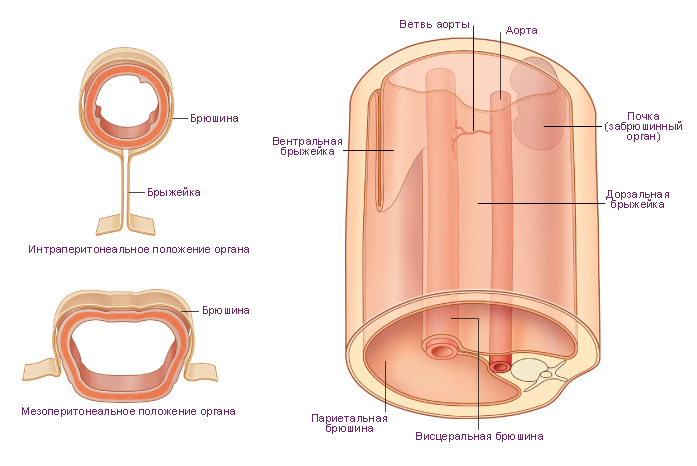
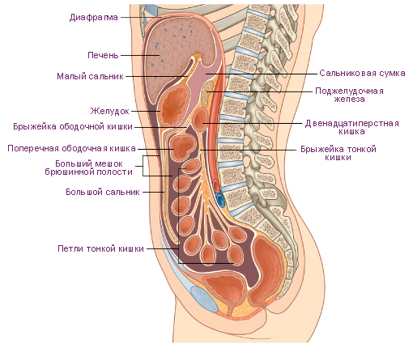
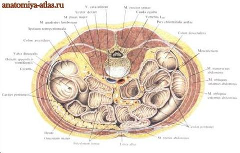
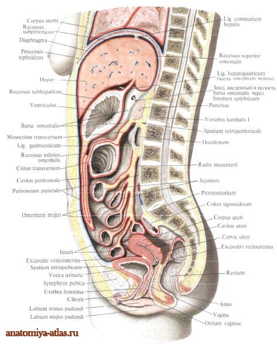
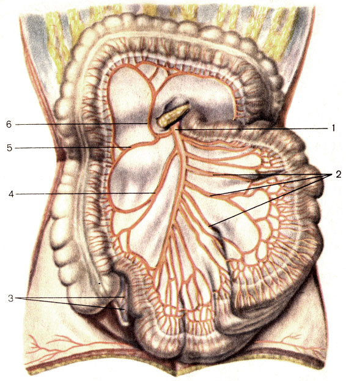
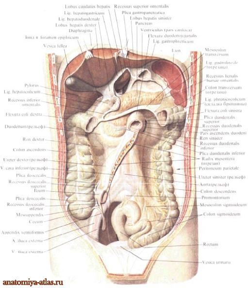

# Соединительные мембраны

**Брюшина** — фасциальная мембрана во внутреннем пространстве брюшной
полости, внешняя поверхность которой крепится к мышечно-скелетным
стенкам, а внутренняя обтекает органы, поддерживая их на своем месте.

**Серозная оболочка** — тонкая плотная соединительнотканная мембрана толщиной около 1 мм, выстилающая внутреннюю поверхность полостей тела человека и животных. К серозным оболочкам относятся брюшина, плевра, перикард и др.  
Серозная оболочка вырабатывает и поглощает специфическую серозную жидкость, которая поддерживает динамические качества внутренних органов. Также она выполняет защитную функцию. При воспалении обычно гладкая, эластичная и прозрачная ткань становится шероховатой, мутной и плотной. В патологических случаях серозная оболочка разрастается вплоть до слипания.

Во внутреннем пространстве брюшной полости часть брюшины, отходя от
заднейстенки брюшной полости, создает **брыжейку** — множество фасциальных
складок, в которые затянут тонкий кишечник. Брыжейка притягивает тонкий
кишечник к спине, балансируя переднюю и заднюю поверхности. Если
брыжейка и мышцы живота сбалансированы, то у внутренних органов
появляется хорошая поддержка. В брыжейку также упакованы все нервные,
лимфатические и кровеносные пути, питающие и иннервирующие кишечник.

Брюшина сзади в области поясничных позвонков с обеих сторон вдается внутрь и образует, таким образом, складку, в которую входят принадлежащие тонкой кишке сосуды и нервы. Сама тонкая кишка лежит лишь в глубине этой сумки, происшедшей из прилегающих друг к другу пластинок брюшины. Таким образом, с одной стороны, имеющая в длину около 6 метров тонкая кишка до некоторой степени удерживается в своем положении и защищается от того, чтобы ее петли не запутывались; с другой - ей обеспечивается несравненно большая степень подвижности, чем, например, та, которою обладает вообще толстая кишка.

